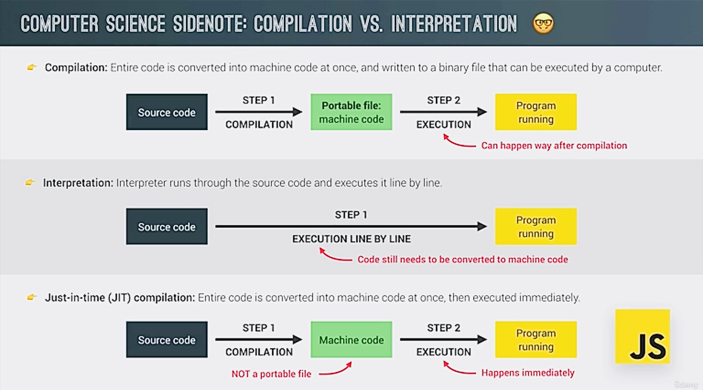
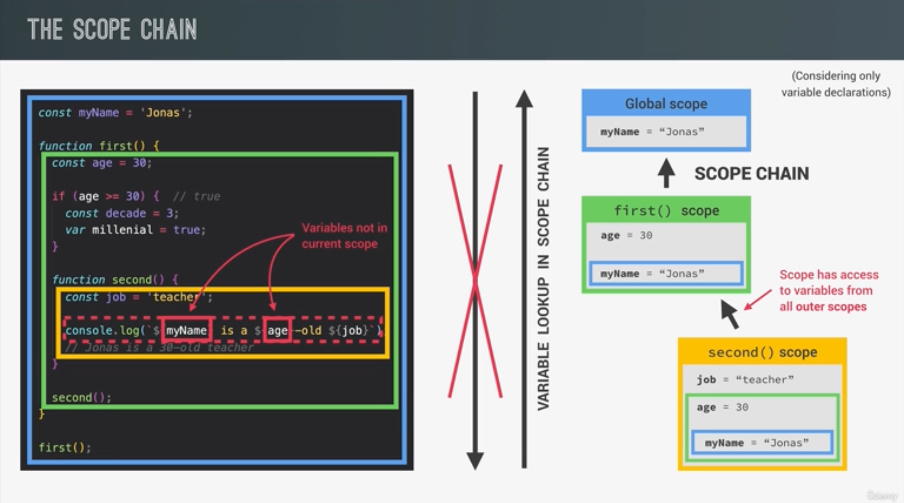
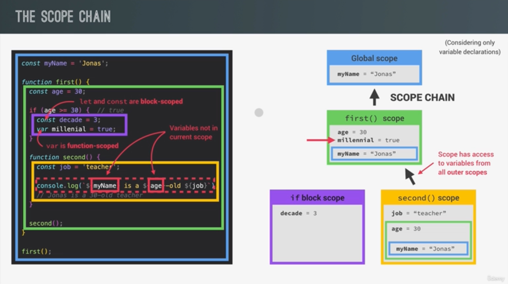
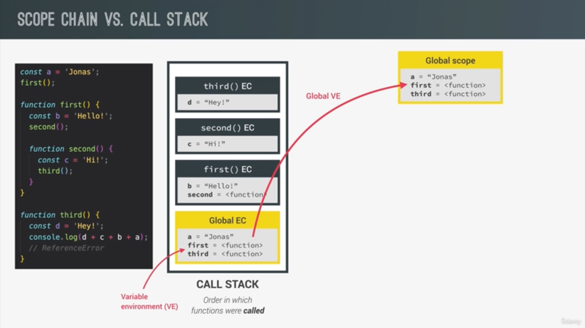
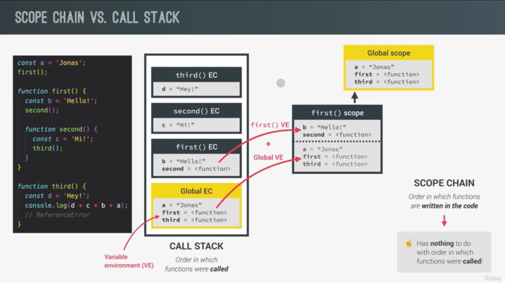
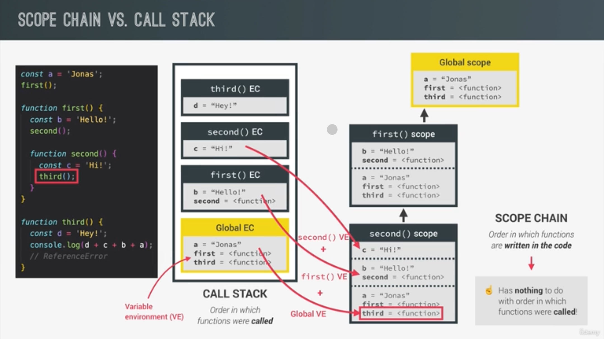
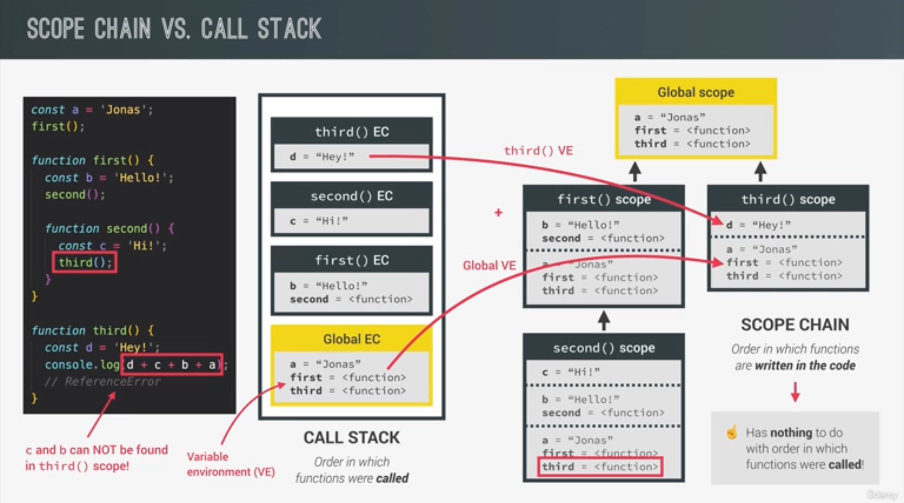
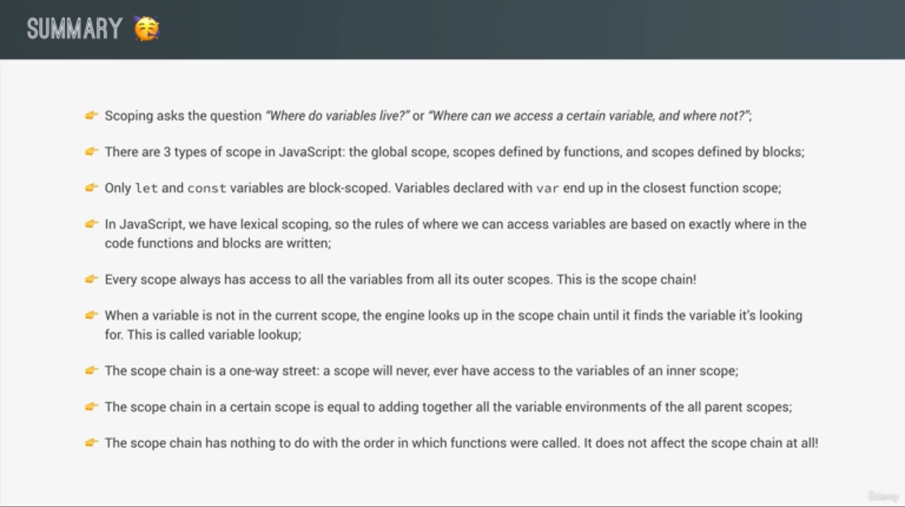

# JavaScript a high-level, object-oriented, multi-paradigm programming language.

DEVELOPER TOOLS KEYBOARD COMMAND

> OPTION + COMMAND + J

- Opens developer window in browser

> Multi-line Comments /\* \*/

## JavaScript Fundamentals – Part 1

1. `High-Level`: A high-level programming language is designed to be more human-readable and abstracted from the hardware details. Focusing on problem-solving vs low-level hardware.

2. `JavaScript` is an object-oriented programming (OOP) language: It supports the concepts of objects and classes, which allow developers to model real-world entities and encapsulate data and behavior within these objects.

3. `Multi-paradigm`: JavaScript is a multi-paradigm language, meaning that it supports various programming styles or paradigms. It is not limited to just one approach but rather offers flexibility in programming.
   - Object-oriented programming (OOP): As mentioned above, JavaScript supports OOP concepts like objects, classes, inheritance, and encapsulation.
   - Functional programming: JavaScript treats functions as first-class citizens, allowing them to be assigned to variables, passed as arguments, and returned as values. This makes functional programming possible in JavaScript.
   - Procedural programming: Although not as common as OOP and functional programming in JavaScript, you can still write code in a procedural style.

### Biggest language change to JavaScript ES6/2015

- Also known as ES6 (ECMA SCRIPT)

### Objects and Primitives

In JavaScript, there are two types of values: objects and primitives. Objects are complex data structures that can contain properties and methods, while primitives are simple values like strings, numbers, and booleans.

```
Object Example:
const person = {
  name: "John Doe",
  age: 30,
  address: "123 Main Street, Az, USA"
};
```

```
Primitive Example:
const number = 10;
const string = "Hello, world!";
const boolean = true;
```

### There are 7 Primitive Data Types

- `Number` : Floating point numbers which means they always have decimals. `let age = 23`

- `String` : Used for text `let firstName = "Jonas"`

- `Boolean` : Logical type that can only be `true` or `false`. `let fullAge = true`

- `Undefined` : Value taken by a variable that is not yet defined (empty value).

- `Null`: Also means empty value.

- `Symbol` (ES2015): Value that is unique and cannot be changed.

- `Biglnt` (ES2020): Larger integers than the Number type can hold.

### Dynamic Typing

JavaScript has dynamic typing: We do not have to manually define the data type of the value stored in a variable. Instead, data types are determined automatically.

In JavaScript, you can assign different data types to a variable during its lifetime. For example, you can initialize a variable with a number, and later reassign it to a string or any other data type:

```
Example:

let myVariable = 42; //  myVariable is a Number

myVariable = "Hello, world!"; // myVariable is now a String

```

### Number _ String _ Boolean are the most used data types.

## Operator Precedence Table

- This is how JS knows order of precedence


## Boolean Logic

Boolean Variables


- Truth Table

# Section 8 - Lesson 89

### Section

- How JS works behind the scenes

### Lecture

- A High Level overview of JS

### JavaScript is high-level, prototype-based object-oriented multi-paradigm interpreted or just-in-time compiled dynamic single-threaded garbage-collected programming language with first-class functions and non-blocking event loop concurrency model.

- `High-Level:` JavaScript is considered a high-level programming language because it abstracts many low-level details, making it easier for developers to work with.

- `Garbage-collected:` JavaScript uses automatic garbage collection to manage memory, freeing up resources when objects are no longer needed.

- `Interpreted or just-in-time compiled:` JavaScript is often interpreted by the browser's JavaScript engine, but modern engines also use just-in-time (JIT) compilation techniques to improve performance.

(Converted to Machine Code 0 and 1's = compiling)

- `Multi-paradigm:` JavaScript supports multiple programming paradigms, including object-oriented, imperative, and functional programming.

Three types of programming

1. Procedural programming
2. Object-oriented programming (OOP)
3. Functional programming (FP)

- `Prototype-based object-oriented:` JavaScript uses a prototype-based object-oriented programming paradigm, where objects can serve as prototypes for other objects, and inheritance is achieved through the prototype chain.

- `First-class functions:` Functions in JavaScript are treated as first-class citizens, meaning they can be assigned to variables, passed as arguments to other functions, and returned as values from other functions.

- `Dynamic:` JavaScript is a dynamically-typed language, meaning variable types are determined at runtime.

- `Single-threaded:` JavaScript typically runs in a single-threaded environment, meaning it executes one operation at a time. However, it supports asynchronous operations through events and callbacks.

- `Non-blocking event loop concurrency model:` JavaScript uses an event-driven, non-blocking concurrency model. This is achieved through the event loop, allowing asynchronous operations without blocking the execution of the main thread.

# Section 8 - Lesson 90

### Section

- How JS works behind the scenes?

### JS Engine

- A JavaScript engine is a software component that executes JavaScript code. It is a crucial part of web browsers and other environments that run JavaScript applications. The engine takes in the JavaScript source code, interprets or compiles it, and then executes the resulting machine code.

### `Compilation vs Interpretation`



Just-In-Time (JIT) compilation is a technique used in programming language implementation where the source code is not compiled ahead of time into machine code but is instead compiled at runtime, just before execution. The primary goal of JIT compilation is to combine some of the advantages of both interpreted and statically compiled languages.

Here's an overview of how JIT compilation works:

1. **Parsing:** The source code is initially parsed and transformed into an intermediate representation, such as an Abstract Syntax Tree (AST) or bytecode. This intermediate representation is then used as a basis for further compilation.

2. **Intermediate Code Generation:** Instead of translating the entire program into machine code before execution (as in traditional ahead-of-time compilation), the JIT compiler generates intermediate code (often bytecode) that is closer to machine code but is not directly executable by the target machine.

3. **Optimizations:** The JIT compiler applies various optimizations to the intermediate code. These optimizations can include inlining functions, removing dead code, and reordering instructions to improve performance.

4. **Code Generation:** The optimized intermediate code is translated into machine code specific to the underlying hardware architecture. This process happens dynamically at runtime, just before the code is executed.

5. **Execution:** The generated machine code is executed directly by the CPU, resulting in the desired program behavior.

JIT compilation offers several advantages:

- **Performance:** JIT compilation can lead to improved runtime performance compared to pure interpretation because the code is translated into machine code with optimizations specific to the target platform.

- **Adaptability:** JIT compilation allows the system to adapt to runtime conditions and optimize code based on actual usage patterns. This is particularly beneficial for long-running applications.

- **Portability:** The intermediate code generated by the JIT compiler is platform-independent, allowing the same bytecode to be executed on different architectures, provided there is a JIT compiler for each platform.

- **Memory Efficiency:** JIT compilation can be memory-efficient because it generates machine code for the portions of code that are actually executed, rather than compiling the entire program upfront.

Common examples of languages that use JIT compilation include Java (which uses the Java Virtual Machine, JVM), C# (with the Common Language Runtime, CLR), and JavaScript (in modern web browsers). The use of JIT compilation has become increasingly prevalent in modern language run times due to its performance benefits and adaptability.

# Section 8 Lesson 91

### Section

- How JavaScript works behind the scenes

### Lecture

- Execution Context and the call back stack

- `An execution context` in JavaScript is an abstract concept that holds information about the environment in which code is executed. Every time a function is invoked, a new execution context is created. This context contains details such as the function's scope, variables, arguments, and the value of the this keyword.

### Types of Execution Contexts:

1. Global Execution Context:

- **Definition:** The default execution context is the initial context created when a JavaScript script starts executing.
- **Global Scope:** It represents the global scope of the script, encompassing `all code that is not inside any function.`
- **Global Object:** In web browsers, the global object associated with the default context is `window`, while in Node.js, it is `global`. All global variables and functions are properties of this object.
- **Lexical Environment:** It maintains a lexical environment containing references to variables and functions defined within it. This environment is used during variable lookup and function invocation.
- **Scope Chain:** Establishes the scope chain for variable resolution. JavaScript searches for variables first in the current scope, then in enclosing function scopes, and finally in the global scope.
- **Lifetime:** The default execution context exists for the entire duration of script execution and is destroyed when the script finishes executing or when the browser window is closed.

Example:

```
console.log("Start"); <--- Global Execution Context

setTimeout(function() {
  console.log("Inside setTimeout callback");
}, 2000);

console.log("End"); <--- statement falls under the default execution context, which is the global execution context.

```

### What's is inside Execution Context?

An execution context in JavaScript consists of various components that manage the execution of code within a specific scope. These components work together to provide an environment for code execution and variable access. Here's what's inside an execution context:

1. **Variable Environment:** The variable environment contains all the declared variables and functions within the current scope. This includes both the formal parameters of functions and any variables declared with `var`, `let`, or `const`.

2. **Lexical Environment:** The lexical environment is a broader concept that encompasses the variable environment. It includes references to variables and functions defined in outer (enclosing) scopes, allowing for lexical scoping. This environment is used during variable lookup and function invocation.

3. **Scope Chain:** The scope chain is a linked list of lexical environments that defines the order in which variables are resolved. When a variable is referenced, JavaScript searches for it first in the current scope's variable environment, then in the outer lexical environments according to the scope chain.

4. **This Binding:** The `this` keyword refers to the object that is currently executing the code. The value of `this` is determined by the context in which a function is called and is set when the function is invoked.

5. **Outer Environment Reference:** Each execution context maintains a reference to its outer (enclosing) lexical environment. This reference allows for nested function scopes to access variables and functions from their containing scopes.

6. **Function Arguments:** When a function is called, its formal parameters and the arguments passed to it are stored within the execution context. These values can be accessed by the function during execution.

7. **Function Invocation:** Information about the function being executed, such as its name and how it was invoked (e.g., as a function, method, or constructor), is also stored in the execution context.

8. **Execution State:** The execution context keeps track of the current state of code execution, including the point at which the execution paused (for example, due to encountering an asynchronous operation or a breakpoint).

Together, these components form the internal structure of an execution context in JavaScript. They provide the necessary environment and data for executing code within a specific scope and ensure proper variable access and function invocation.

### What is the creation phase?

The creation phase, also known as the "preparation" or "setup" phase, occurs right before the execution phase in the lifecycle of a JavaScript execution context. During this phase, several important tasks are carried out to prepare the environment for code execution. The creation phase primarily involves the following key steps:

1. **Creation of the Variable Environment:**

   - JavaScript allocates memory for variables and functions declared within the scope of the execution context.
   - Variables declared with `var` are initialized with a value of `undefined`, while functions are fully defined and can be invoked.
   - For variables declared with `let` and `const`, a "temporal dead zone" is created, and these variables are not accessible until the actual execution phase.

2. **Creation of the Lexical Environment:**

   - The lexical environment is established, which includes references to variables and functions defined in outer (enclosing) scopes.
   - This step establishes the scope chain that determines the order of variable resolution during code execution.

3. **Determination of the Value of `this`:**

   - The value of the `this` keyword is determined based on how the current function was invoked.
   - For functions invoked as methods of objects, `this` refers to the object containing the function.
   - For functions invoked in the global scope or through explicit binding, `this` may refer to the global object (`window` in browsers) or another specified object.

4. **Binding of Outer Environment Reference:**

   - Each execution context maintains a reference to its outer (enclosing) lexical environment.
   - This reference allows inner function scopes to access variables and functions from their containing scopes, forming lexical closures.

5. **Function Declaration and Variable Hoisting:**

   - Function declarations (`function` statements) are fully defined and added to the variable environment during the creation phase. These functions can be invoked anywhere within their containing scope, even before their actual declaration in the code (due to hoisting).
   - Variable declarations with `var` are also hoisted to the top of their containing scope, but they are initialized with `undefined` until they are assigned a value during the execution phase.

6. **Creation of Arguments Object (if applicable):**
   - For function execution contexts, an `arguments` object is created, which provides access to the arguments passed to the function.

Once these preparation steps are completed during the creation phase, the execution context transitions to the execution phase, where the actual code within the scope is executed line by line.

### Important to NOTE about -> arrow functions!

Arrow functions in JavaScript have some notable characteristics in relation to execution context, which distinguish them from traditional function expressions and function declarations. Here are the key points to note about arrow functions:

1. **Lexical `this` Binding:**

   - Arrow functions do not have their own `this` context. Instead, they inherit `this` from the surrounding lexical scope (the context in which they are defined).
   - This behavior contrasts with regular functions, which have their own `this` context that is determined by how the function is called.

2. **No `arguments` Object:**

   - Arrow functions do not have their own `arguments` object. If you need to access the arguments passed to an arrow function, you can use the `arguments` object from the enclosing non-arrow function or use rest parameters (`...args`) instead.

3. **No `super` Binding:**

   - Arrow functions do not have their own `super` context. If you use `super` within an arrow function, it will refer to the `super` binding of the enclosing non-arrow function.

4. **No `new.target` Binding:**

   - Arrow functions do not have their own `new.target` binding. `new.target` within an arrow function will inherit the `new.target` value of the enclosing non-arrow function.

5. **Can't Be Used as Constructors:**

   - Arrow functions cannot be used as constructors with the `new` keyword. Attempting to instantiate an arrow function using `new` will result in a runtime error.

6. **Implicit Return:**

   - Arrow functions with a single expression can have an implicit return, meaning you can omit the `return` keyword and curly braces `{}` if the function body consists of only one expression.

7. **No `arguments`, `super`, or `new.target`:**
   - In arrow functions, the identifiers `arguments`, `super`, and `new.target` are resolved lexically, meaning they are searched for in the lexical scope chain and not in the function's own scope.

In summary, the lexical `this` binding and lack of certain binding features (like `arguments`, `super`, and `new.target`) make arrow functions behave differently in terms of execution context compared to regular functions. It's important to understand these differences when using arrow functions in your JavaScript code to avoid unexpected behavior.

Of course! Let's illustrate the differences between arrow functions and regular functions with visual examples:

### 1. Lexical `this` Binding:

```javascript
// Regular function with its own 'this' context
const regularFunction = {
  name: "Regular Function",
  greet: function () {
    console.log(`Hello from ${this.name}`);
  }
};

// Arrow function inheriting 'this' from the surrounding scope
const arrowFunction = {
  name: "Arrow Function",
  greet: () => {
    console.log(`Hello from ${this.name}`);
    console.log(`Hello from ${arrowFunction.name}`);
  }
};

regularFunction.greet(); // Output: Hello from Regular Function
arrowFunction.greet(); // Output: Hello from undefined (lexical 'this' from surrounding scope)
```

In the above example, the regular function `greet()` correctly logs the name from its containing object (`regularFunction`). However, the arrow function `greet()` logs `undefined` because it inherits `this` from the surrounding scope, where `this` is not defined.

### 2. No `arguments` Object:

```javascript
// Regular function with 'arguments' object
function regularFunctionWithArgs() {
  console.log(arguments);
}

// Arrow function attempting to use 'arguments'
const arrowFunctionWithArgs = () => {
  console.log(arguments); // ReferenceError: arguments is not defined
};

regularFunctionWithArgs(1, 2, 3); // Output: [1, 2, 3]
arrowFunctionWithArgs(1, 2, 3); // Error: ReferenceError: arguments is not defined
```

In the above example, the regular function `regularFunctionWithArgs()` correctly logs the `arguments` object. However, the arrow function `arrowFunctionWithArgs()` throws a `ReferenceError` because arrow functions do not have their own `arguments` object.

### 3. No `super` Binding:

```javascript
class Parent {
  constructor() {
    this.name = "Parent";
  }

  sayHello() {
    console.log(`Hello from ${this.name}`);
  }
}

class Child extends Parent {
  constructor() {
    super();
    this.name = "Child";
  }

  // Regular function attempting to use 'super'
  greetRegular() {
    super.sayHello(); // Output: Hello from Child
  }

  // Arrow function attempting to use 'super'
  greetArrow = () => {
    super.sayHello(); // Error: ReferenceError: super is not defined
  };
}

const child = new Child();
child.greetRegular(); // Output: Hello from Child
child.greetArrow(); // Error: ReferenceError: super is not defined
```

In the above example, the regular function `greetRegular()` successfully calls the `sayHello()` method of the parent class using `super`. However, the arrow function `greetArrow` throws a `ReferenceError` because arrow functions do not have their own `super` binding.

### Function Execution Context:

1. **Definition:**

   - A function execution context represents the environment in which a function is executed.
   - Each time a function is called in JavaScript, a new execution context is created for that function.

2. **Components:**

   - **Variable Environment:** Contains variables, function declarations, and formal parameters of the function. This environment is where local variables and function declarations are stored.
   - **Lexical Environment:** A broader concept that includes the variable environment and references to variables and functions defined in outer (enclosing) scopes. It establishes the scope chain for variable resolution.
   - **Scope Chain:** A linked list of lexical environments that defines the order in which variables are resolved during code execution. It enables JavaScript to find variables in the correct scope.
   - **This Binding:** Determines the value of the `this` keyword within the function. The value of `this` is based on how the function is called.
   - **Outer Environment Reference:** A reference to the lexical environment of the containing scope. It allows inner functions to access variables from their outer (enclosing) scopes, forming lexical closures.
   - **Function Arguments:** Stores the arguments passed to the function. This can be accessed using the `arguments` object or using rest parameters (`...args`).
   - **Function Invocation:** Information about the function being executed, such as its name and how it was invoked (e.g., as a function, method, or constructor).
   - **Execution State:** Tracks the current state of code execution, including the point at which the execution paused (e.g., due to an asynchronous operation).

3. **Creation Phase:**

   - Before a function's code is executed, JavaScript performs a creation phase where it sets up the function's execution context.
   - During this phase, JavaScript allocates memory for variables and functions, establishes the scope chain, determines the value of `this`, and prepares for code execution.

4. **Execution Phase:**
   - Once the creation phase is complete, the function's code is executed line by line.
   - JavaScript uses the function's execution context to access variables, execute statements, and handle function calls.

Understanding the function execution context is crucial for comprehending variable scope, function behavior, and the overall flow of code execution in JavaScript. It helps developers understand how variables are accessed, how `this` behaves, and how closures work.

# Call Stack - JS Engine

The call stack is a data structure used by the JavaScript runtime environment to manage the execution of function calls in a program. It keeps track of the currently executing function and the order in which functions are called, enabling the JavaScript engine to know where to return after a function call completes.

Here's a more detailed explanation of the call stack:

1. **Function Calls:** When a function is invoked in JavaScript, a new frame representing that function's execution context is pushed onto the call stack. This frame contains information such as the function's arguments, local variables, and the location in the code where the function was called.

2. **Stack Data Structure:** The call stack operates on a Last-In-First-Out (LIFO) principle, meaning that the most recently added function call is the first to be executed and returned from. This behavior makes the call stack resemble a stack data structure, where elements are added and removed from the top.

3. **Function Execution:** As the JavaScript engine executes the code inside a function, it may encounter other function calls (including recursive calls or calls to built-in functions). Each new function call results in the creation of a new frame on top of the call stack.

4. **Returning from Functions:** When a function completes execution (either by reaching the end of its code or encountering a `return` statement), its frame is popped off the call stack, and control returns to the function that invoked it. This process continues until the call stack is empty, indicating that the program has finished execution.

5. **Managing Function Calls:** The call stack effectively manages the execution flow of function calls in JavaScript, ensuring that functions are executed in the correct order and that control is returned to the appropriate locations in the code after each function call completes.

6. **Stack Overflow:** If the call stack grows too large due to an excessive number of nested function calls (typically caused by infinite recursion), it can lead to a stack overflow error, which terminates the program. This error occurs when the call stack reaches its maximum capacity and cannot accommodate additional function calls.

In summary, the call stack is a fundamental concept in understanding the execution flow of JavaScript programs. It provides a structured way to track function calls and manage program execution, enabling functions to be executed in the correct order and returning control back to the appropriate locations in the code.

Example Video:
[Call Stack Example with Event Loop](https://www.youtube.com/watch?v=FVZ-A_Akros)

# Section 8 Lesson 92

### Section

- How JS works behind the scenes

### Lecture

- Scope and the Scope Chain

### Scoping and Scope in JS: Concepts

- In JavaScript, scoping refers to the rules that determine the visibility and accessibility of variables and functions within different parts of a program. Scoping determines which parts of the code have access to which variables, and it helps prevent naming conflicts and maintain the integrity of variables.

- JavaScript uses lexical scoping, also known as static scoping. This means that the scope of a variable is determined by its location within the code when the program is written, rather than when it is executed. Lexical scoping allows for nested scopes, where inner scopes have access to variables declared in outer scopes, but not vice versa.

### Lexical Scoping

Lexical scope, also known as static scope, is a characteristic of programming languages where the scope of a variable is determined by its location within the source code during the lexical analysis phase of compilation. In simpler terms, lexical scope means that the visibility and accessibility of variables are based on where the variables are declared and not where they are called or executed.

1. **Scope Determination at Compile Time:**

   - In lexical scope, the scope of a variable is determined by the structure of the code at the time it is written, rather than at runtime.
   - When a variable is referenced, the JavaScript engine looks for the variable in the lexical scope chain, which is established based on the nesting of function and block scopes in the code.

2. **Nested Scope Hierarchy:**

   - Lexical scope allows for nested scopes, where inner functions or blocks have access to variables declared in outer functions or blocks.
   - Variables declared in an outer scope are accessible in all inner scopes, but variables declared in an inner scope are not accessible in outer scopes.

3. **No Dynamic Scope Changes:**

   - Unlike dynamic scoping, where the scope of a variable can change based on the calling context, lexical scope remains static and does not change based on how or where a function is called.

4. **Lexical Closure:**
   - Lexical scope enables the concept of closures, where inner functions have access to variables from their outer enclosing scope even after the outer function has finished executing.

In JavaScript, lexical scope is a fundamental concept that governs variable visibility and accessibility. It allows developers to write code in a modular and organized manner, ensuring that variables are accessible where they are needed while minimizing the risk of unintended side effects or variable conflicts. Understanding lexical scope is crucial for writing clean, maintainable JavaScript code.

### What is exactly is Scope in JS?

Scope: Space or environment in which a certain variable is declared (variable environment in case of functions). There is global scope, function scope, and block scope.

Scope of a variable: Region of our code where a certain variable can be accessed.

## The 3 Types of Scope in JS

- Global Scope
- Function Scope
- Block Scope

### Global Scope

```javascript
const me = "Sonny";
const job = "Developer";
const year = 1984;
```

Global scope in JavaScript refers to the area of a program where variables and functions are accessible from anywhere within the code, regardless of where they are declared. Here's a simple definition:

**Global Scope:**

- Variables and functions declared outside of any function or block have global scope.
- Global variables and functions are accessible from anywhere in the code, including inside functions, blocks, or other files.
- They act as the highest level of scope in a JavaScript program, providing a common space for storing and accessing shared data and functionality.

In simpler terms, anything declared outside of a function or block in JavaScript belongs to the global scope. This means that global variables and functions can be accessed and used from anywhere in the code, making them widely accessible but also potentially prone to unintended modifications or conflicts.

### Function Scope

```javascript
function calcAge(birthYear) {
  const now = 2037;
  const age = now - birthYear;
  return age;
}
console.log(now); //Reference Error...cannot access outside the function!!!
```

Function scope in JavaScript refers to the area of a program where variables and functions are accessible only within the function in which they are declared.

**Function Scope:**

- Variables and functions declared inside a function have function scope.
- Function-scoped variables and functions are only accessible within the function in which they are declared.
- They are invisible from outside the function, meaning they cannot be accessed or modified from other parts of the code.

In simpler terms, anything declared inside a function in JavaScript belongs to the function scope. This means that function-scoped variables and functions are limited in visibility and can only be used within the function where they are defined. They provide encapsulation and help prevent naming conflicts with variables and functions declared in other parts of the code.

### Block Scope (ES6)

```javascript
if (year >= 1981 && year <= 1996) {
  const millennial = true;
  const food = "Avocado Toast";
} // <-- Example if block for loop block

console.log(millennial); //Reference Error...
```

Block scope in JavaScript refers to the area of a program where variables declared using `let` or `const` are accessible only within the block in which they are declared. Here's a simple definition:

**Block Scope:**

- Variables declared with `let` or `const` inside a block have block scope.
- Block-scoped variables are only accessible within the block in which they are declared. A block is typically defined by curly braces `{}`.
- They are invisible from outside the block, meaning they cannot be accessed or modified from other parts of the code.

In simpler terms, anything declared with `let` or `const` inside curly braces `{}` in JavaScript belongs to the block scope. This means that block-scoped variables are limited in visibility and can only be used within the block where they are defined. Block scope provides a finer level of control over variable visibility and helps prevent variable leaks and conflicts.

## The Scope Chain

```javascript
const myName = "Sonny";

function first() {
  const age = 39;

  if (age >= 30) {
    const decade = 3;
    var millennial = true;
  }
  function second() {
    const job = "Developer";
    console.log(`${myName} is a ${age}-old ${job}`);
  }
  second();
}
```

### The Global Scope

```javascript
// variable
myName = "Sonny"; // Also known as Global Variable

// function
first();
```

### First Scope

```javascript
const age = 39;

if (age >= 30) {
  const decade = 3;
  var millennial = true;
}
```

### Second Scope

```javascript
function second() {
  const job = "Developer";
  // Variables not in current scope
  console.log(`${myName} is a ${age}-old ${job}`);
}
```

- `Scope has access to variables from all outer scopes`!

```javascript
${myName} and ${age} // are accessible from parent scope
```

Nested Structure of Scopes

- Variable lookup in scope chain



First Scope does not have access to variables in second scope! Can only look up not down.

- Child to Parent. Not Parent to Child.

### Another item note is let, const, and var in scope chain

- let and const are block-scoped
- var is function-scoped



### Lexical Scoping Continued

```javascript
const myName = "Sonny"; // global constant accessible throughout the entire code

function first() {
  // first
  const age = 30; // constant age

  if (age >= 30) {
    // nested block
    const decade = 3; // constant
    var millennial = true; // The variable millennial, declared with var inside the nested block, is accessible throughout the first function due to variable hoisting.
  }
  function second() {
    // second inner function
    const job = "Student";
    console.log(`${myName} is a ${age}-old ${job}`);
  }
  second();
}

first();
```

If you change the declaration of the **variable millennial from var to const**, it would have the following impact on the code:

```javascript
const myName = "Sonny";

function first() {
  const age = 30;
  if (age >= 30) {
    const decade = 3;
    const millennial = true; // Changed from var to const
  }
  function second() {
    const job = "Student";
    console.log(`${myName} is a ${age}-old ${job}`);
    console.log(millennial); // Trying to access millennial outside its block
  }
  second();
}

first();
```

When millennial is declared with const, it becomes block-scoped to the if block in which it is defined. It is not accessible outside this block.
Attempting to access millennial outside of the if block, such as in the second function, will result in a **ReferenceError**.

### Scope Chain vs Call Stack ???

* EC = Execution Context

```javascript
const a = "Sonny";
first();

function first() {
  const b = "Hello";
  second();

  function second() {
    const c = "Hi";
    third();
  }
}

function third() {
  const d = "Hey!";
  console.log(d + c + b + a);
}
```

* The order of function calls is not relevant to the scope chain at all.

* Order in which functions are called



Global VE (Variable environment)



Second() will have access to parent scope 



* Final Result of Call Stack



In the given block of code, changing the declaration of `c` from `const` to `var` would not resolve the reference error when trying to access `c` in the `third` function. Let's break down why:

```javascript
const a = "Sonny";
first();

function first() {
  const b = "Hello";
  second();

  function second() {
    var c = "Hi"; // Changed from const to var
    third();
  }
}

function third() {
  const d = "Hey!";
  console.log(d + c + b + a); // Attempting to access c, b, and a
}
```

1. **Scope of `c` with `var`:**
   - When `c` is declared with `var` inside the `second` function, it becomes function-scoped to the `second` function. It is not block-scoped like `const`.
   - While `var` variables are hoisted to the top of their containing function, they are not accessible outside the function in which they are defined.

2. **Accessing `c` in `third`:**
   - In the `third` function, attempting to access `c` would still result in a `ReferenceError`, even if `c` were declared with `var`.
   - This is because `c` is scoped to the `second` function, and it is not accessible outside of the `second` function.

Therefore, changing the declaration of `c` from `const` to `var` would not resolve the reference error when trying to access `c` in the `third` function. The error would persist because `c` is still not accessible in the scope of the `third` function.

### Summary 

